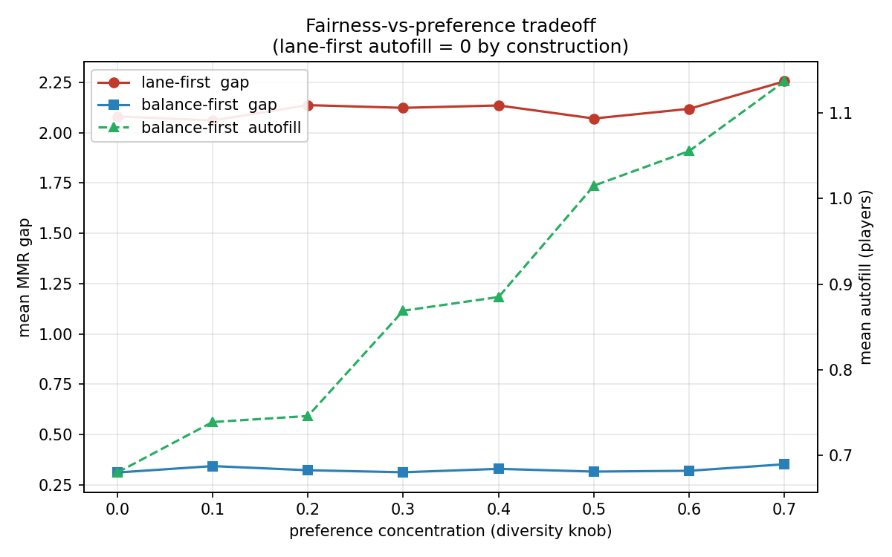
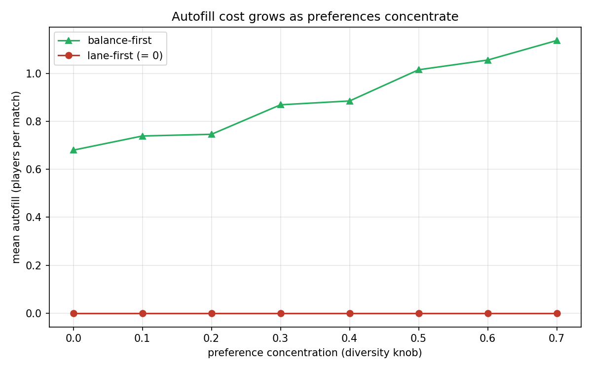
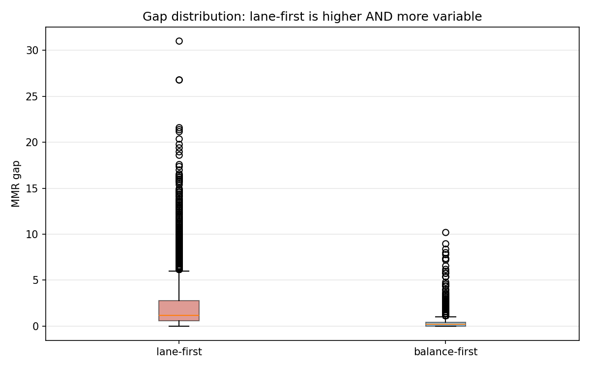
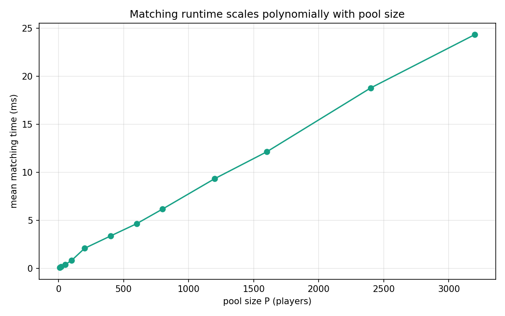

# 1 Introduction

## 1.1 Context

Competitive online games in the MOBA genre — _League of Legends_, _Honor of
Kings_, and their peers — build every match from a live queue of waiting
players. A 5v5 match needs exactly ten players sorted into two teams of five,
and each player occupies one of five lanes (TOP, JUG, MID, ADC, SUP). The system
that assembles these matches is the _matchmaker_, and it must satisfy several
goals at once: the two teams should be close in skill, so the match is fair;
players should get to play the lanes they prefer, so the match is enjoyable; and
all of this must happen fast, on a queue that may hold hundreds of players.

These goals pull against each other. The skill measure — a hidden
matchmaking rating, or **MMR** — and the lane preferences are independent
attributes, so the fairest split of ten players by MMR need not be one in which
everyone plays a preferred lane, and vice versa. Real games resolve this tension
differently: some protect lane assignments and tolerate skill imbalance, others
balance skill aggressively and ask players to "flex" off their preferred lane.
That difference in philosophy is what this report models and measures.

## 1.2 Problem Statement

We model matchmaking as a three-stage pipeline — **pool**, **match**,
**balance** — and ask one question: when matching (which serves preference) and
balancing (which serves fairness) conflict, which should run first? We call the
two answers _lane-first_ and _balance-first_ and treat them not as right and
wrong but as two settings of a single fairness–preference tradeoff.

Around that question sits a complexity thesis with two sides. Deciding
**feasibility** — whether ten players can be assigned to five lanes within their
preferences — is a polynomial-time problem, solvable as a max-flow. Finding the
**optimal balance** — the split of a pool into two teams minimizing the skill
gap — is NP-hard in general. Our matches are nonetheless tractable, but only
because a match is a fixed, ten-player instance small enough to brute-force; the
hardness of the general problem and the ease of our instance are independent
facts, and keeping them distinct is a theme we return to throughout (§2.3.4).
This report develops the pipeline (§2), specifies the experiments (§3), and
reports the tradeoff and a scalability check (§4).

# 2 Method

The pipeline operates on four data structures. A **Player** carries an
identifier, an integer MMR, and a primary and secondary lane preference; two
fields — an assigned lane and an autofill flag — start empty and are filled in
by matching. A **Pool** is the compact, ten-player set that Stage 1 extracts
from a snapshot. A **Team** is five players together with their lane assignment
and a count of how many were autofilled. A **Match** pairs two teams and records
the resulting MMR gap and total autofill. The three stages below transform a
raw snapshot into a Match: pooling produces a Pool (§2.1), lane matching decides
and produces lane assignments (§2.2), and balancing cuts a pool into two teams
(§2.3); §2.4 then sets out the two orderings in which matching and balancing can
be composed.

## 2.0 Scope and Assumptions

The model above is deliberately narrow, and stating its boundaries up front
keeps the tradeoff we study well-defined. We assume a **static snapshot**: the
queue is a single fixed set of waiting players, not a stream that arrives and
departs over time, so we do not model online or dynamic matching. We form a
**single match** at a time rather than batching several matches from the same
snapshot jointly. Lane preferences are **unweighted and one-sided** — each
player simply marks a primary and a secondary lane as acceptable, with no
numeric strength and no two-sided stability between players and lanes — which is
what lets us model assignment as an unweighted, capacity-constrained bipartite
matching rather than a weighted or stable-matching problem. Skill is a **single
scalar MMR**, not a per-champion or per-role profile. Finally, players queue
**individually**, so we do not handle pre-formed parties.

These assumptions are not oversights but the choices that pin the problem to the
specific model we analyze; each of them can be relaxed, and doing so moves the
problem into a different and generally harder regime, which we return to as
future work in §5.

## 2.1 Pooling (Stage 1)

A static snapshot may hold hundreds of queued players, and balancing teams
optimally over a set that large is intractable (the balancing problem is
NP-complete; see §2.3). Pooling reduces the snapshot to a small,
brute-forceable instance: a compact, lane-feasible 10-player pool $P$. We fix
$|P| = 10$ because a 5v5 match needs exactly ten players, and because holding
it constant lets the comparison experiment feed the _same_ ten players to
both orderings — isolating the ordering as the only variable. (The pool size
is parameterized, not hard-coded, so the scalability analysis in §4.2 can grow
it.)

$P$ must be both **MMR-compact** (so teams can be balanced with a small gap)
and **lane-feasible** (assignable to the five lanes, two each, using only
preferred lanes). These can conflict, so pooling is a search: we sort the
snapshot by MMR (on a copy, leaving the caller's data untouched) and slide a
fixed-width window of 10 from lowest to highest, returning the first feasible
window. Sorting makes every contiguous window automatically MMR-compact, so
window position alone controls compactness.

Feasibility is decided by reusing the Stage 2 (see §2.2) matching as an oracle: a window
is feasible iff its max-flow equals 10 (equivalently, autofill is zero). We
do _not_ inspect assigned lanes — autofill fills lanes even for infeasible
pools, faking feasibility.

Why a fixed window rather than growing one and letting max-flow pick 10 from
a larger set? Max-flow only certifies feasibility; its chosen ten ignore MMR
and may be scattered, breaking compactness. Recovering the most compact
feasible ten would mean searching $\binom{|W|}{10}$ subsets. A fixed window
keeps compactness built into the input instead of recovered afterward.

Sorting is $O(n\log n)$, the scan is $O(n)$ windows each needing one
polynomial-time max-flow — so the stage is polynomial, matching the
"feasibility is polynomial" half of our thesis.

## 2.2 Lane Matching (Stage 2)

Lane matching decides whether a set of players can be assigned to the five lanes using only lanes they are willing to play, and if so produces such an assignment. This is where **feasibility** lives: a match is role-complete only if every lane is staffed, so the question "can these players form a valid match?" reduces to "does a complete lane assignment exist?" We answer it by modeling the assignment as a **bipartite matching** (二分图匹配) and solving that matching as a **max-flow** (最大流) problem, following CLRS §26.3.

The construction places the players on one side and the five lanes on the other, and threads flow from a source through players and lanes to a sink. Formally we build a directed network $G = (V, E)$ with $V = \{s, t\} \cup P \cup L$, where $P$ is the player set and $L = \{\text{TOP}, \text{JUG}, \text{MID}, \text{ADC}, \text{SUP}\}$. There are three layers of edges. Each edge $(s, p_i)$ has capacity $1$, forcing every player to occupy at most one lane. Each edge $(p_i, \ell)$ has capacity $1$ and exists only when $\ell$ is player $p_i$'s primary or secondary preference — non-preferred lanes are simply absent, which is how "assign only within preference" is encoded structurally. Each edge $(\ell, t)$ has capacity $c$, bounding how many players a lane may hold.

The lane capacity $c$ is the one parameter that varies by caller. When the matcher assigns a single five-player team, $c = 1$: each lane takes exactly one player, and a max-flow of $5$ certifies a clean assignment. When it screens a ten-player pool — as the Stage 1 oracle does, and as lane-first (§2.4) does over the whole pool — $c = 2$: each lane must seat two players, one destined for each side, and a max-flow of $10$ certifies the pool can later split into two role-complete teams. In both cases the sink's total in-capacity is $5c$, so the flow is capped at $|P|$ by construction.

Reading the result is therefore direct: the pool is feasible **iff** its max-flow equals $|P|$, equivalently iff every lane edge into $t$ saturates. When flow falls short, the shortfall is exactly the number of players who could not be placed within preference, and we record it as $\text{autofill} = |P| - \text{max\_flow}$; these players are subsequently filled into whatever lanes remain open. Crucially, feasibility is read from the flow value alone and never from whether players ended up with an assigned lane — autofill assigns lanes even to infeasible pools, so an "everyone has a lane" check would report false feasibility (this is the red line the Stage 1 oracle depends on, §2.1).

**Hall's theorem** (霍尔定理) supplies the structural reason a pool passes or fails, complementing the numerical verdict max-flow returns. A perfect assignment exists iff for every subset $S$ of players, the lanes they collectively prefer, $N(S)$, satisfy $|N(S)| \ge |S|$ (in the capacitated form, $|N(S)| \cdot c \ge |S|$). A violated Hall condition — some group of players crowding onto too few lanes — is precisely what produces autofill, and it locates the bottleneck rather than merely counting it. The distinction worth keeping in view is that max-flow _computes_ the answer while Hall _explains_ it; tightening preferences makes the condition harder to satisfy, changing whether a solution exists, but never changes the polynomial cost of checking.

We solve the flow with **Edmonds-Karp** (BFS-based augmenting paths), whose $O(VE^2)$ bound is a small constant here since $V, E = O(n)$ with $n$ fixed at $5$ or $10$. This is the payoff for the thesis: because a feasibility check is one polynomial-time max-flow, and Stage 1 issues a linear number of such checks, establishing whether a role-complete match _can_ be formed is polynomial — the "feasibility is polynomial" half of §Thesis, standing opposite the NP-hardness of optimal balancing in §2.3.

One caveat is worth stating plainly, as the analysis in §2.4 leans on it. Because primary and secondary edges carry equal capacity $1$, the matcher does not _guarantee_ primary preferences are honored over secondary ones; when it happens to prefer primaries, that is an artifact of the BFS visiting primary edges first, not a property the model enforces. Enforcing genuine priority would require weighting the edges, which moves the problem to weighted assignment (out of scope; see §Limitations). We therefore treat all preferences as unweighted and report the primary-first tendency as an emergent behavior rather than a structural guarantee.

## 2.3 Team Balancing (Stage 3)

Team balancing takes the ten pooled players and splits them into two teams of
five, minimizing the difference in aggregate MMR between the sides. This is the
stage that makes a match _fair_: a small MMR gap means neither team is
predetermined to win before the game begins. Formally, writing the ten MMR
values as $w_1, \dots, w_{10}$, we seek a partition into $G_1, G_2$ with
$|G_1| = |G_2| = 5$ that minimizes
$\bigl|\sum_{i \in G_1} w_i - \sum_{i \in G_2} w_i\bigr|$.

We solve this by brute force. Because a match is fixed at ten players, there
are only $\binom{10}{5}/2 = 126$ distinct ways to cut the pool into two teams
of five — dividing by two because swapping the red and blue labels yields the
same partition — and we enumerate all of them, keeping the one with the
smallest gap. At this size the enumeration is instantaneous.

The reason this stage warrants discussion at all, rather than being a trivial
loop, is that the balancing problem is NP-complete _in general_, and it is only
the small, fixed instance size that lets us brute-force it. The rest of this
section makes that claim precise, as it is the theoretical core of the project
and the source of the "optimization is hard" half of our thesis (§Thesis). We
stress at the outset that NP-completeness is a _classification_ of the general
problem, not a statement about our ten-player instance; §2.3.4 returns to this
distinction.

### 2.3.1 The decision version

Complexity classes such as P and NP are defined over _decision_ problems —
those with a yes/no answer — because membership in NP is defined by
polynomial-time _verification_ of a candidate answer, which presupposes a
yes/no question. Our balancing objective is an optimization ("minimize the
gap"), so to classify its difficulty we first state its decision form:

> **BALANCE-DEC.** Given $2m$ MMR values $w_1, \dots, w_{2m}$ and a threshold
> $k$, does there exist a partition into two teams of exactly $m$ players each
> with $\bigl|\text{sum}_1 - \text{sum}_2\bigr| \le k$?

Membership in NP is immediate: a proposed partition serves as a certificate,
and verifying it — summing each side and comparing the difference to $k$ —
takes polynomial time. It remains to establish hardness.

### 2.3.2 NP-hardness: a reduction from PARTITION

We reduce from a classical NP-complete problem (CLRS §34.5):

> **PARTITION.** Given positive integers $S = \{a_1, \dots, a_n\}$ with total
> $T = \sum_i a_i$, does there exist a subset $A \subseteq S$ with
> $\text{sum}(A) = T/2$?

We show $\text{PARTITION} \le_p \text{BALANCE-DEC}$; since PARTITION is
NP-complete, this makes BALANCE-DEC NP-hard.

**Construction.** Given a PARTITION instance $S$, build a BALANCE-DEC instance
with $n$ _real_ players of MMR $a_1, \dots, a_n$ and $n$ _dummy_ players of
MMR $0$; set $m = n$ (teams of $n$) and $k = 0$. This is linear in $n$. The
dummy players are a gadget that reconciles the one structural mismatch between
the problems: PARTITION places no constraint on how many elements fall on each
side, whereas BALANCE-DEC forces the two teams to have _equal cardinality_. The
zero-valued dummies pad either team up to size $n$ without affecting its sum.

**Equivalence.** We show $S$ is a yes-instance of PARTITION if and only if the
constructed instance is a yes-instance of BALANCE-DEC.

$(\Rightarrow)$ Suppose $A \subseteq S$ with $\text{sum}(A) = T/2$, and let
$p = |A|$. Place the $p$ real players of $A$ on team one and pad with $n - p$
dummies; this team has $n$ players and sum $T/2$. The remaining $n - p$ real
players (summing to $T/2$) plus the remaining $p$ dummies form team two, also
of size $n$ and sum $T/2$. The gap is $0 \le k$, so BALANCE-DEC answers yes.
(The dummies suffice exactly: $(n - p) + p = n$ are used.)

$(\Leftarrow)$ Suppose the two teams $G_1, G_2$ each have $n$ players and
$\text{sum}_1 = \text{sum}_2$. Dummies contribute $0$, so each team's sum is
carried entirely by its real players; since the real total is $T$ and the two
sides are equal, the real players on $G_1$ sum to $T/2$. They therefore form a
subset of $S$ summing to $T/2$, so PARTITION answers yes. $\blacksquare$

Combining the two directions, $\text{PARTITION} \le_p \text{BALANCE-DEC}$, so
BALANCE-DEC is NP-hard. With membership in NP (§2.3.1), **BALANCE-DEC is
NP-complete.**

_Remark._ Because the teams are forced to equal size, adding any constant $C$
to all $2n$ MMR values raises each team's sum by $nC$ and leaves the gap
unchanged. The reduction thus goes through with strictly positive MMRs if
zero-valued players are deemed unrealistic — a small illustration that the
equal-cardinality constraint, far from being an obstacle, is what makes the
gadget clean.

### 2.3.3 The optimization version is NP-hard

Our implementation returns the _minimum_ gap, i.e. it solves the optimization
problem BALANCE-OPT, not the decision problem BALANCE-DEC. The hardness carries
over. An oracle that returns the minimum gap answers "is there a partition with
gap $\le k$?" with a single comparison, giving
$\text{BALANCE-DEC} \le_p \text{BALANCE-OPT}$; the optimization version is thus
at least as hard as the (NP-complete) decision version. BALANCE-OPT is,
moreover, _not known to be in NP_: verifying that a given partition achieves the
minimum gap appears to require comparison against all other partitions, so no
polynomial-time certificate is evident. We therefore classify BALANCE-OPT as
**NP-hard** rather than NP-complete.

### 2.3.4 Classification versus instance size

These results classify the _general_ problem, in which the player count is an
unbounded input; they state that there is _no known polynomial-time algorithm_
that balances arbitrarily large rosters optimally. They say nothing about any
particular instance. Our matches are fixed at ten players, so the search space
is a constant $126$ partitions and brute force is not merely feasible but
instantaneous. The justification for brute force is therefore the small
instance size, _not_ the NP-hardness: the classification and the tractability
of our instance are independent facts. (Compare the travelling-salesman
problem, which remains NP-complete even though a four-city instance is solvable
by hand.) This is precisely the two-sided structure of our thesis — feasibility
is polynomial (§2.2), optimal balancing is NP-hard in general (§2.3), and our
project is solvable only because each match is a small, fixed instance.

## 2.4 Two Orderings: Lane-first vs Balance-first

The three stages fix _what_ we compute, but not the order in which lane
matching and balancing run against each other. That ordering is the design
choice at the heart of this report, because the two stages optimize for
different things — matching for preference satisfaction, balancing for a small
MMR gap — and whichever runs first constrains the other. We therefore implement
both orderings and compare them; neither is "correct," they are two points on
the fairness–preference tradeoff, each mirroring a real design philosophy.

**Lane-first** matches before it balances. It runs Stage 2 over the entire pool
at capacity $c = 2$, seating two players in every lane, and then splits those
already-assigned players into two teams. Because each lane already holds exactly
two players — one bound for each side — the split is not a free choice over all
$126$ partitions but a constrained one: for each of the five lanes we decide
which of its two occupants goes red and which goes blue, giving $2^5 = 32$
candidate splits. We enumerate them and keep the one with the smallest MMR gap.
Every player lands in a preferred lane by construction, so **autofill is
identically zero**; the price is that the gap is only as small as the best of
those $32$ lane-constrained splits, with no freedom to trade a player's lane for
a better balance. This is the philosophy of a game that treats role integrity
as sacrosanct.

**Balance-first** balances before it matches. It runs Stage 3 first — the free
$126$-partition search of §2.3 — to cut the pool into the two teams with the
smallest possible gap, ignoring lanes entirely; then it runs Stage 2
independently within each five-player team at capacity $c = 1$ to assign lanes.
Because the split is unconstrained, the gap it achieves is at least as small as
lane-first's, and usually smaller. But a team chosen purely for MMR balance is
not guaranteed to be lane-feasible on its own: pool-level feasibility (five
lanes, two each) does not imply that an arbitrary five-player half can staff all
five lanes from preferences alone. When it cannot, matching backfills the empty
lanes off-preference, and **autofill becomes positive**. This is the philosophy
of a game that treats fairness as paramount and asks players to flex.

The asymmetry is the whole story. Lane-first pays for zero autofill with a
larger, lane-constrained gap; balance-first pays for a minimal gap with nonzero
autofill. A subtle consequence, which the experiments confirm, is that the two
orderings respond differently to _preference diversity_: lane-first's gap and
(zero) autofill are structurally fixed regardless of how concentrated
preferences are, whereas balance-first's autofill grows as preferences
concentrate, because concentrated preferences make an MMR-chosen half
increasingly likely to be lane-infeasible.

# 3 Experiment Setup

## 3.1 Synthetic Data Generation

Because no public dataset pairs hidden MMR with lane preferences, we generate
synthetic queue snapshots. Each player carries an MMR drawn uniformly from a
fixed range and a distinct (primary, secondary) lane-preference pair; MMR and
preferences are generated independently, since skill and role taste are
unrelated attributes.

The one experimental knob is **preference concentration** $\gamma \in [0, 1]$,
which controls how clustered lane preferences are. At $\gamma = 0$ each lane is
equally likely to be chosen, so preferences spread evenly across the five
lanes. As $\gamma$ rises, probability mass shifts onto a fixed pair of "hot"
lanes (MID and ADC, standing in for the carry roles players contest in
practice) and away from the "cold" lanes, until at $\gamma = 1$ the hot lanes
absorb all of it. Concretely, each lane's base probability $1/5$ is redirected
toward the hot lanes in proportion to $\gamma$, keeping the five weights a valid
distribution. This single parameter is the independent variable of the whole
comparison: it lets us sweep from a perfectly diverse player population to a
pathologically concentrated one and watch the tradeoff respond.

Every snapshot is generated from a fixed random seed, so the entire experiment
is reproducible. Player identifiers are clean, whitespace-free strings, which
matters because the comparison joins the two orderings' outputs by identifier.

## 3.2 Metrics

We record two quantities per match, one for each side of the thesis. The **MMR
gap** is the absolute difference in mean MMR between the two teams —
$\lvert \overline{\text{MMR}}_{\text{red}} - \overline{\text{MMR}}_{\text{blue}}
\rvert$ — and measures unfairness: a large gap is a lopsided match. Both
orderings compute it identically, subtracting team sums before dividing by team
size rather than the reverse, so that the two pipelines' gaps are bit-for-bit
comparable and not separated by floating-point rounding. The **autofill count**
is the number of players placed in a non-preferred lane, and measures
preference dissatisfaction: it is zero for lane-first by construction, and the
sum of the two teams' off-preference placements for balance-first.

For the comparison experiment we sweep $\gamma$ from $0.0$ to $0.7$ in steps of
$0.1$, and at each setting draw many independent snapshots, pool each down to a
feasible ten (Stage 1), and run _both_ orderings on that same pool so the only
difference is the ordering. We stop at $\gamma = 0.7$ deliberately: beyond it,
concentrated preferences make feasible pools so rare that too few snapshots
survive pooling to estimate the metrics reliably. Within $0.0$–$0.7$ the
feasible-pool rate stays near one, so this truncation costs us nothing in the
regime we report; the shrinking feasibility at higher $\gamma$ is itself an
observation we return to in §4.1. The scalability experiment (§4.2) is separate
and does not use $\gamma$ at all, since runtime depends on pool size, not on the
preference distribution.

# 4 Analysis

## 4.1 Fairness–Preference Tradeoff

The central result is that the two orderings occupy opposite corners of the
tradeoff, exactly as their designs predict (Figure 1). Across the whole sweep,
lane-first holds its autofill at zero while its mean MMR gap sits around $2.1$;
balance-first holds its gap near $0.3$ — roughly a sevenfold improvement in
fairness — while paying a positive autofill that climbs from about $0.7$ to
about $1.1$ players per match. Neither ordering dominates: each buys one virtue
with the other's cost.

**Figure 1.** Fairness–preference tradeoff across the concentration sweep. Left axis: mean MMR gap for both orderings. Right axis: balance-first's mean autofill (lane-first's is zero by construction).

Two features of the data deserve comment because they are not obvious a priori.

First, **lane-first's gap does not fall as we might hope** — it stays flat near
$2.1$ regardless of $\gamma$, and stays clearly above balance-first's. The
flatness is a consequence of pooling: Stage 1 already hands both orderings an
MMR-compact ten, so any split of it starts from a small spread, and preference
concentration (which is about lanes, not MMR) cannot change that. The residual
gap above balance-first is structural: lane-first chooses among only $32$
lane-constrained splits, while balance-first chooses freely among $126$, so
balance-first can always reach a split at least as balanced. The gap between the
two lines is thus the price of the lane constraint, not an artifact of the data.

Second, **balance-first's autofill rises with concentration** (Figure 2). When
preferences are diverse, an MMR-chosen half is usually lane-feasible on its own
and needs little backfill; as preferences concentrate on MID and ADC, a half
drawn for MMR balance increasingly contains too many players wanting the same
lanes, forcing off-preference placement. This is the mechanism behind the whole
tradeoff: concentration does not degrade _fairness_ under either ordering, it
raises the _preference cost_ that balance-first must pay to keep fairness high.

**Figure 2.** Mean autofill versus preference concentration. Balance-first's cost climbs as preferences cluster on the hot lanes; lane-first stays at zero.

The distributions sharpen the point (Figure 3). Lane-first's gap is not merely
higher on average but far more variable: its box is tall and its outliers reach
past $30$, meaning it occasionally produces severely lopsided matches — the
"the other team's jungler is far stronger" experience. Balance-first's gap
distribution is tight against zero with few and small outliers. So balance-first
is not only fairer on average but far more _consistent_, a fact the mean alone
hides.

**Figure 3.** Distribution of the MMR gap over all trials. The box spans the middle 50% of matches, the line inside is the median, and the circles are outlier matches. Lane-first is both higher and far more variable.

Finally, the feasibility truncation of §3.2 is itself a finding: as $\gamma$
approaches and exceeds $0.7$, the fraction of snapshots that yield any feasible
pool drops sharply. Under extreme concentration the difficulty is no longer
_which_ ordering to use but whether a legal, role-complete match can be formed
at all — feasibility, not optimization, becomes the binding constraint.

## 4.2 Scalability

The comparison above lives at a fixed match size of ten. The scalability
question is separate: as the queue from which we pool grows, does the
feasibility check — the max-flow of Stage 2 — stay cheap? This matters because
the "feasibility is polynomial" half of our thesis is only useful in practice
if the polynomial is a mild one.

We measure the mean runtime of a single capacity-2 matching call as the pool
size $P$ grows from $10$ to $3200$ players, averaging many repeated runs per
size from a fixed seed (Figure 4). Runtime rises smoothly and close to linearly
with $P$: from a fraction of a millisecond at $P = 10$ to roughly $44$ ms at
$P = 3200$, with each doubling of $P$ roughly doubling the time.

**Figure 4.** Mean runtime of one capacity-2 matching call as pool size $P$ grows. Near-linear growth confirms the feasibility check is polynomial-time. The growth is
polynomial — and notably milder than Edmonds–Karp's worst-case $O(VE^2)$,
because our sink capacity is fixed at $5c$, capping total flow independently of
$P$ and so bounding the number of augmenting paths. The practical import is that
verifying whether a candidate window is lane-feasible stays in the millisecond
range even for pools of thousands, which is what makes the Stage 1 scan over
many windows affordable.

The measured time includes the defensive deep copy the matcher makes to avoid
mutating its input; that copy is itself linear in $P$ and does not change the
polynomial conclusion. The contrast with balancing is the point of the whole
project: feasibility scales gracefully with pool size, while optimal balancing
is NP-hard (§2.3) and would explode with match size — which is exactly why the
architecture confines balancing to a fixed ten-player match and lets pooling and
matching absorb the scale.

# 5 Conclusion

We modeled MOBA matchmaking as a three-stage pipeline — pool, match, balance —
and used it to study a single design question: should lane matching or team
balancing run first? The two orderings are not right and wrong but two ends of a
fairness–preference tradeoff. Lane-first guarantees every player a preferred
lane at the cost of a larger, lane-constrained MMR gap; balance-first achieves a
much smaller and more consistent gap at the cost of off-preference placements,
and that cost grows as preferences concentrate. The choice between them is
really a choice of what a game values.

Underneath the comparison sits a two-sided complexity story that the pipeline
was built to expose. Checking feasibility — can these players staff five lanes?
— is a polynomial-time max-flow that scales gently with pool size, while
balancing optimally is NP-hard in general. Our matches are tractable not because
the hard problem became easy but because each match is a small, fixed
ten-player instance; the classification and the tractability are independent
facts. Pooling and matching carry the scale, and balancing is deliberately
penned into a constant-size instance where brute force is instantaneous.

Several limitations point to future work. Our model is deliberately narrow: a
one-sided, unweighted, capacity-constrained matching with two-lane preferences,
no party queuing, and MMR as a single scalar. Richer settings — weighted or
two-sided-stable matching, dynamic queues that arrive over time, or batching
several matches at once — are all natural extensions, and each moves the problem
into a different (and generally harder) corner of the design space than the one
we fixed here. We also truncated the comparison at moderate preference
concentration, where feasible pools remain common; the regime beyond, where
forming any legal match becomes the dominant difficulty, is worth a study of its
own. What our results establish within these bounds is clean and, we think,
intuitive: the order in which you satisfy people and balance them is not a
detail but the tradeoff itself.
